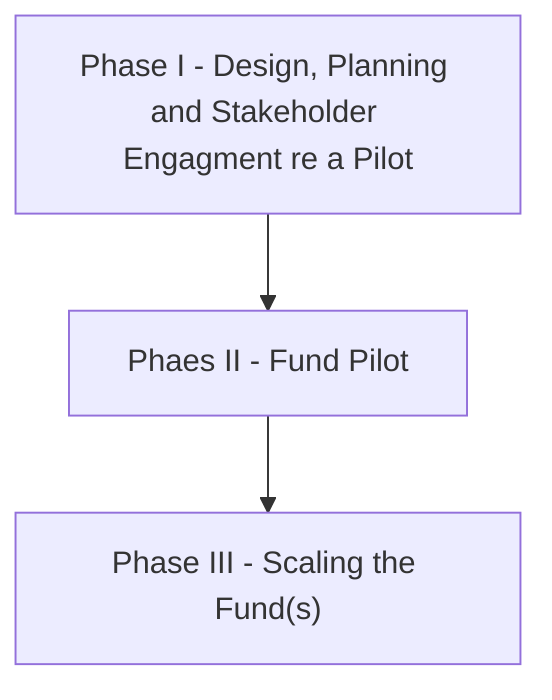
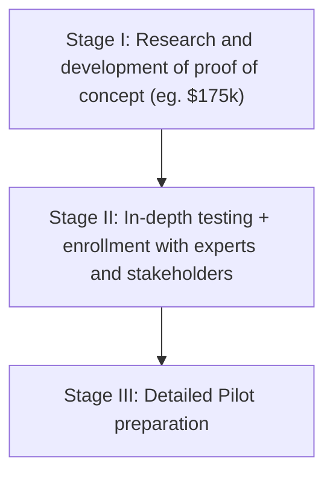
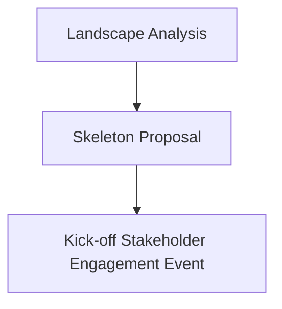

How can we fund market driven research and innovation and have the resulting information freely and universally accessible for all to use, build on and share?

Answer: Open Information Funds and [[../remuneration-rights|Remuneration Rights]]

The next question is: how do we create Open Information Funds?

This piece provides some first thoughts on the practical strategy and steps to their creation. These ideas have been motivated by our work on the [[../imed/|IMED project]].

# Strategy

There are three major stages in getting to an operational fund.

## Phase I

There are three stages:

## Phase I - Stage I

This would involve doing three things:

Skeleton PoC (not full), engagement with initial stakeholders, and support for Stage II from key stakeholders especially a set of core funders/supporters.

* PoC: Finishing a robust skeleton proof of concept. This includes research on what is already out there and who to talk to.
  * Even if no further funding this is really useful
* Prepare the approach/strategy: how do we build a winning coalition, communications
  * How can you sell this to people 
  * Even if no further funding this is really useful
* Building up an initial stakeholder group, and in particular a group of funders to support further stages and especially the actual creationg of a fund

> [!note]
> 
> Ultimately, the issue is not the idea itself -- though it is surprising how unfamiliar some of the core ideas are to key stakeholders e.g. nonrival goods, delinking access and remuneration. After all, we aren't the first people to have ideas like this -- though we do have important differences in emphasis, largely reflecting "political" considerations about how we can market this.
> 
> Rather the challenge is execution and, in particular, "enrollment": getting enough people on board to do the first successful pilot. That first pilot is the policy innovation and once you have the first one you will quickly get copying.
> 
> This implies that much of the work is on:
> 
> - messaging: this is really important. This work is about communications as much as anything else
> - ready to act: making sure there is a good proposal ready to go given the fickleness and speed of political will.
> - identifying a political/stakeholder strategy

A question: at this point, is it about doing a pilot or just to continue to work towards a pilot?

ANS: this is just about stage 1 of developing pilot and there are more stages ...

* Generally, you will need more than this phase to develop a pilot as getting real stakeholders on board is a multi-year exercise in most areas.
* Resourcing: Pepsi spend $7m launching a new brand of crisps. It needs hundreds of thousands of dollars -- if not millions -- to launch a major new policy idea like this.
* This phase is about getting a robust skeleton, demonstrating to supporters that it is worth further funding, engaging some initial stakeholders and identifying targets for next round

### Overview of Activities

