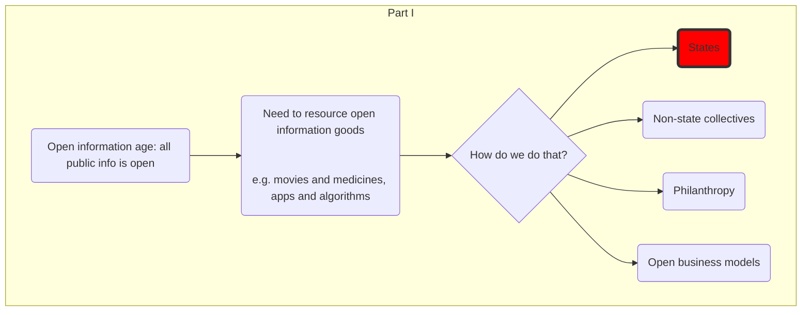
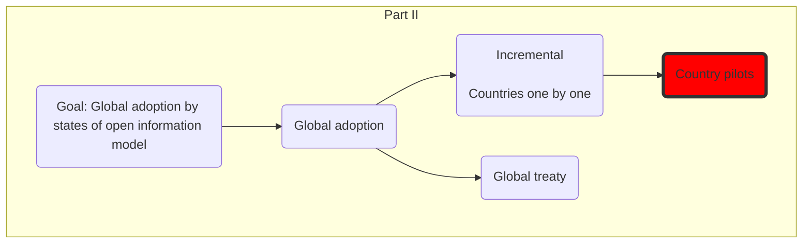
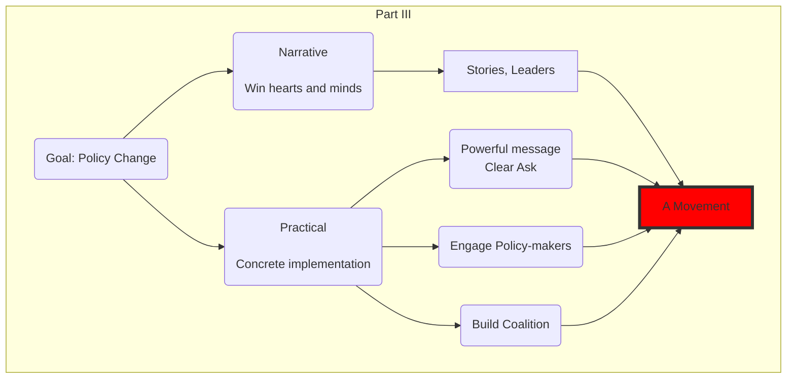

Building an open world - one bit at a time.

## Vision

An inclusive, democratic and dynamic knowledge economy [society]

democratic = inclusive and free

Alternative adjectives: Free, fair, creative

## Mission

Make the knowledge economy open:

> All [public](## "non-personal. Specifically: information which could be legally and legitimately sold or shared with others.") information is open
>
> and
>
> Creators and innovators are recognized and rewarded

public = non-personal. Specifically: information which could be legally and legitimately sold or shared with others.

More and Why? **See manifesto**

-----------------------------------------------------------

## Theory of Change

How to achieve this goal. Logic. Working back from end goal.

### Part I

1. Goal: Open information age: all public info is open

2. Resourcing of open information goods -- new movies and medicines, new apps and algorithms

    *  Plus changes around monopoly rights and remuneration rights

3. To provide resourcing, have following options:

    1. States: collective resourcing from citizens with funds disbursed a) up-front b) remuneration rights
    2. Non-state collectives e.g. "Information Coops" -- groups who come together to resource 
      * Cons: very limited scale. If they do have scale, they look like the state.
      * Pros: can get started now, ground up.
    3. Philanthropy:
      * Limited in size relative to state. Very dependent on "rich philanthropists"
      * Valuable as a way of demoing idea and pushing political change
    4. Individual voluntarism
      * Very limited scale. Rewarding for individuals and a way to motivate engagement (more fun to build buildings than work on building regulations)
    5. Open business models: complementary goods ("fries and ketchup")
      * Very limited again in scale. Also in terms of what we can do: not much we can do to help -- maybe subsidies. In addition, they will be massively helped by remuneration rights => focus on the state option.

(1) is the only option to realise the goal

> Other options produce value -- and should not be ignored -- but are not focus.

Why? It is states who have the means to provide collective funding and the governance systems to manage the legitimate distribution of those monies. [For more: see the book!]

=> We need to a new policy at state level [to create open info funds etc]

### Part II - State Level Implementation

1. Goal: Global adoption by states of open information model

    * A change from where we are today
    * Can move incrementally: both on country adoption and on subject matter (music, medicines etc)

Aside: lots of options for how we realise this ... at this point ...

Two directions of expansion:

* By "subject matter" -- e.g. adopt for music, then for medicines
* By country -- adopt in EU then get adoption in US

We can move in both directions simultaneously. Once we have an open pilot for, say, music in one country we can expand that to other countries. Similarly, once we have music we can expand to movies. (This is how IP worked).

|         | Music | Movies | Medicines | Apps | ... |
|---------|:-----:|:------:|:---------:|:----:|-----|
| Finland |   |   |   --   |     --    |   >  |     |
| UK      |   |   |        |           |      |     |
| US      |   V   |        |           |      |     |
| China   |       |        |           |      |     |
| ...     |       |        |           |      |     |

> **Comment** process here can be cyclical (spiral) escalation rather than all in one win. E.g. we start getting one or two pilots where one or two countries trial open world model in a specific area such as music or medicines (the M&M approach). Then when that works we can scale up to more countries etc.

The natural expansion logic is by country -- that way there are more and more people sharing the fixed cost of creation. Thus, you can read the next section as applying to a specific subject matter like music or medicines.

2. Global adoption

    * International treaties
    * Critical mass of countries

3. Multiple countries adopt this

4. A successful pilot in a country

> Comment: don't have to do incremental approach. Can go for "all in one" option with a global treaty. [cf. discussions with Jamie]

=> We need a pilot or a global treaty

=> Policy change in one country or in one treaty

### Part III - A Pilot (or a Treaty)

To achieve policy change requires:

A. Narrative levels - win hearts and minds

    * A general change in mentality - information is different, open world is possible. This is high level. Change both in specific stakeholder groups and in general populace.
    * Measure: "Green today means sustainable / enviro friendly" - compare that to 1970s* Specific proposals

B. Practical level - politics and policy engagement for implementation [build a coalition, policy proposals]

To achieve practical change (B):

1. A powerful message about change including concrete proposal, backing evidence and most importantly simple, coherent branding and narrative
2. Engagement with key policy-makers
3. Create winning coalition for change (grow a pro group and reduce the anti group)

To do this => build a movement.

> Comment: [importance of the narrative level] You can't just go in on the practical level, you need a context, a societal narrative. This creates the receptivity in policy-makers as well as the groundswell of support.

> **Comment** commonalities with environmentalism and climate change. At a political level, open world effort has much in common with environmentalism. In environmentalism, there is a collective public good such as a stable climate and a need for political action to maintain carbon levels to achieve this. This is similar to a collective public good of new information and the need for political action to fund its creation. The open information community is fortunate to have several major advantages compared to environmentalism. Most importantly, an open world is a win-win situation where we can both get more information and have greater access -- this reflects the "magical" infinite copies property of information goods. In environmentalism it is more zero-sum reflecting the issue of over-use of a limited rival common resource be that the atmosphere or a fishery. In environmentalism we need to make cut backs now for benefits in the future. Such trade-offs are esp hard politically.

### Part IV - Building a Movement

* Goal and vision

* "Leaders" => Vanguard
  * Spread Message
  * Enroll others
  * Coordinate
  * May be in positions of authority and power longer term

* Resourcing

* Membership
  * Support
  * Resourcing

## What to To?

Multi-pronged:

1. Research and Set out Policies - Think-Tank

    * Economics of information age. From spending on pharma R&D to funding flows
    * New models for funding and resourcing information production
    * Convening experts and high-level stakeholders
    * Develop coherent policies
    * State of the nation: what is going on re open and closed. Where is open doing well / not so well?

2. Win hearts and minds - Advocacy and Marketing

    * Conceptual: bits are not bread, information is different. Monopoly rights rather than intellectual property
    * Recognize and celebrate: gov funded research, open projects like Wikipedia
    * Marketing and branding of the concept

3. Implementation - pilots and scaling up

  * Strategic Analysis and Preparation -- what subject matter in what country? Think through multiple combinations.

## Mission

* Advocate for open information world
* Create policies that support this